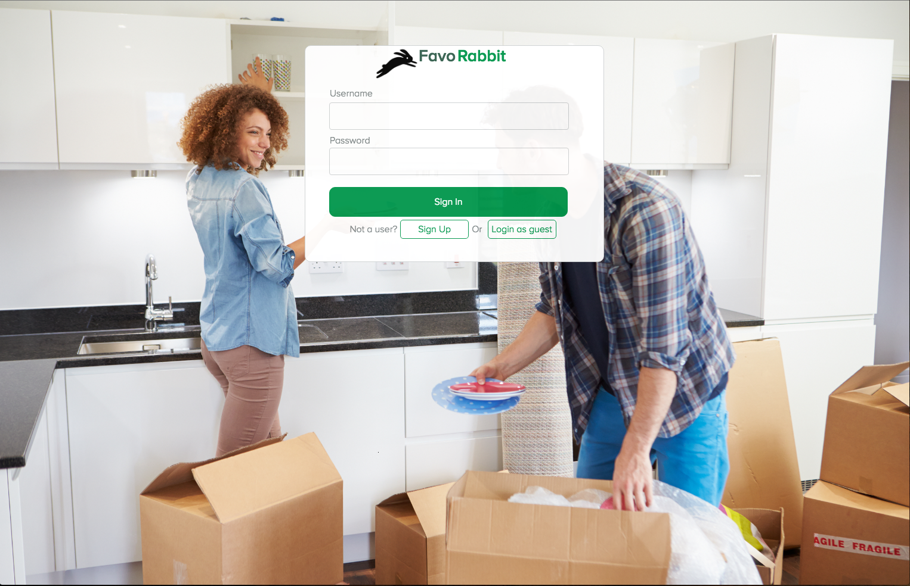
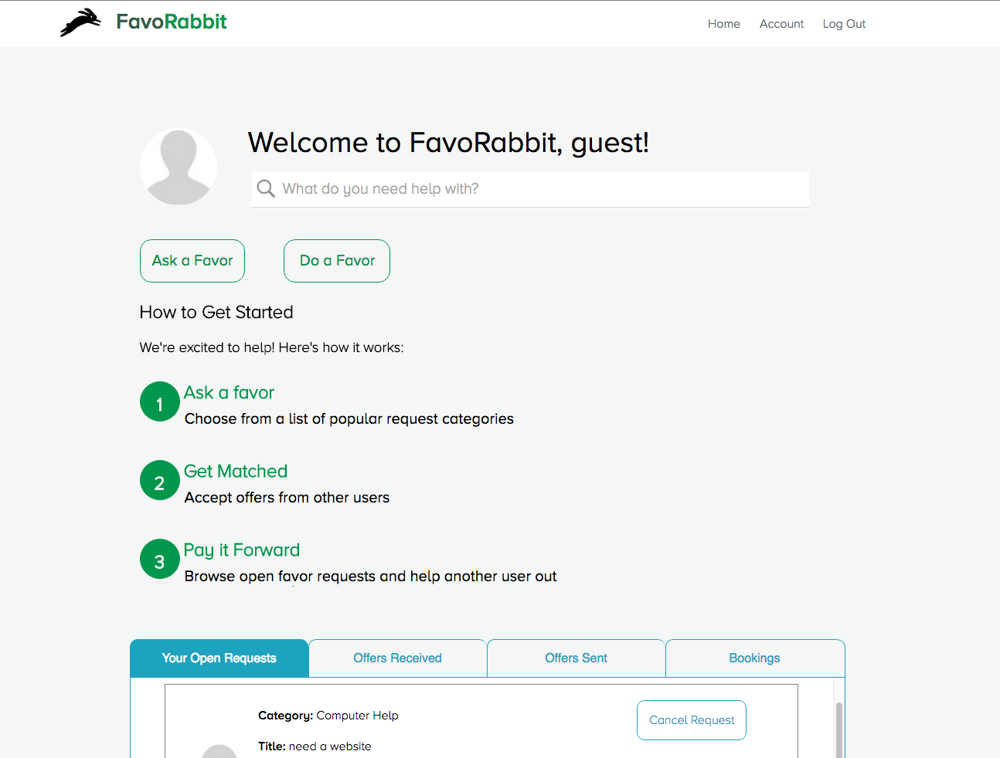
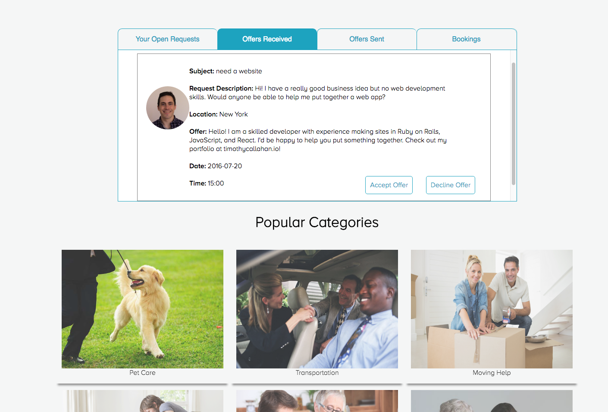
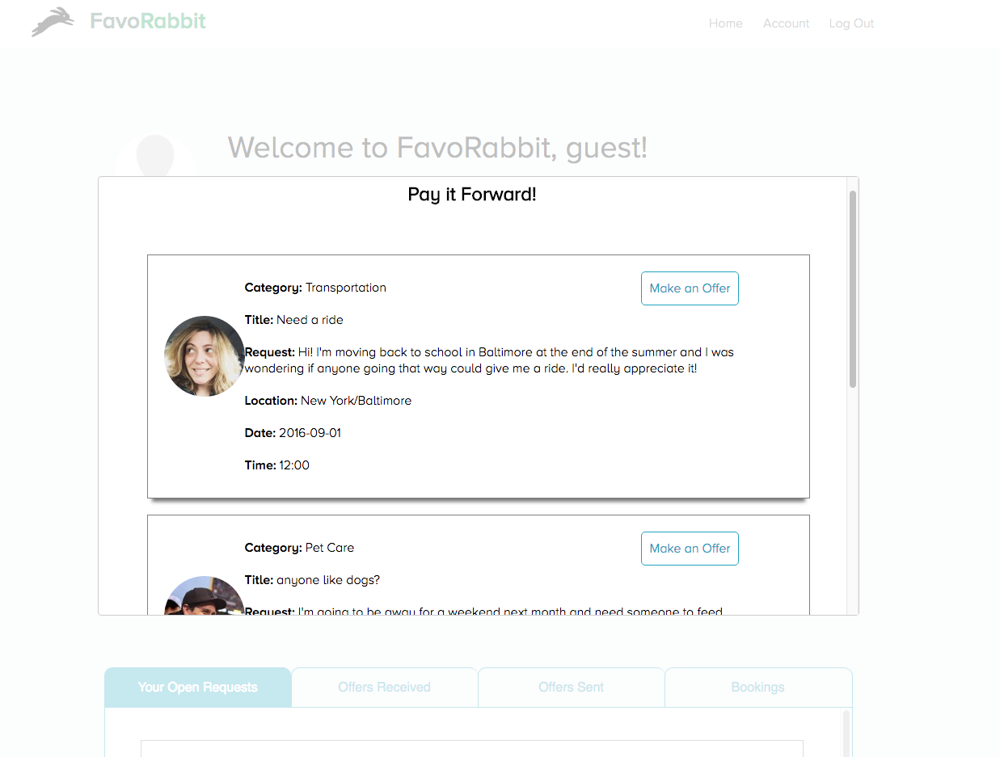

#FavoRabbit

[Heroku link][heroku]

[heroku]: http://www.favorabbit.herokuapp.com

FavoRabbit is a full-stack web application inspired by TaskRabbit. It utilizes Ruby on Rails on the backend, a PostgreSQL database, and React.js with a Flux architectural framework on the frontend.

## Screenshots

## Features & Implementation

### Single-Page App
  All the content for FavoRabbit is delivered on one static page.

### Requests
  User requests are stored in a table with columns for all the request information, including a reference to the
  users table through a 'requester_id.' On the front end the dashboard component listens to a request store and
  fetches all open requests on componentDidMount.

  Clicking on the 'do a favor' button will render a modal that displays an request index component comprised of
  request detail components.

  Users can submit requests and make offers for other user's requests.

### Offers
  Similar to requests, offers are stored in a table with columns for all offer information, but with a reference
  to the user table through a 'doer_id.' Upon mounting, the dashboard makes an api call to fetch all offers made for
  the current users open requests.

  Offers made for any of a current user's requests are displayed in the dashboard upon clicking the 'offers received' tab. Users can view as well as accept of deny these offers.

## Future Directions for the Project
  I plan to continue fine tuning this application. Below are some potential future improvements.

### Messaging  
  I would like to add the ability for users to append further messages to existing accepted offers. This make sense from a functional point of view as it would allow further discussion about the logistics of a favor. One way to implement this would be to create a messages table that would have a foreign key referencing the offer it is attached to. Then the offer detail component would display all messages associated with it.

###Signing in with Google, Facebook etc.
  I plan to make use of the OAuth gem in order to allow users to sign in with their credentials from other popular
  web apps.
